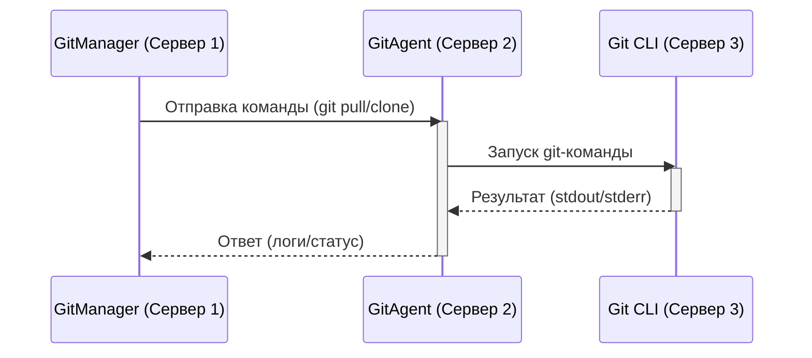

## GitManager
Что это и зачем?

Изначально была идея дать пользователю простой нитерфейс для работы с 1с по методологии Git Flow. Решение представляет из себя 3 коомпонента:
* GitManager 
* GitAgent
* Cli приложение (https://github.com/Untru/pivo-cli)

GitManager и GitAgent Это одна и та жа конфигурация. Идея сделать GitAgent родилась изза того что по сети сборка и разборка исходников работает очень долго, по этому основная база отправляет команды в GitAgent И он уже запускает скрипты.

Общая схема работы:





## Старт работы
Для начала работы необходимо создать пользователя с правами "Администратор", далее необходимо заполнить
Настройки пользователя:

Обязательно необходимо заполнить Проект и токен от внешнего репозитория и так же почту пользователя

Проект
Пример заполнения основных полей 


После заполнения базы необходимо создать репозиторий по кнопке

Для работы с гитхаб необходимо установить

[GitHub CLI](https://cli.github.com/)
У службы под которой запужена 1с должны быть права на шару папки


Необходимо запустить RAC как службу

``` bat 
@echo off
rem %1 - полный номер версии 1С:Предприятия
set SrvUserName=.\USR1CV8
set SrvUserPwd="c2o3"
set CtrlPort=1540
set AgentName=localhost
set RASPort=1545
set SrvcName="1C:Enterprise 8.3 Remote Server 26"
set BinPath="\"C:\Program Files\1cv8\8.3.26.1540\bin\ras.exe\" cluster --service --port=%RASPort% %AgentName%:%CtrlPort%"
set Desctiption="1C:Enterprise 8.3 Remote Server 26"
sc stop %SrvcName%
sc delete %SrvcName%
sc create %SrvcName% binPath= %BinPath% start= auto obj= %SrvUserName% password= %SrvUserPwd% displayname= %Desctiption%
```

Для вывода логов
set LOGOS_CONFIG=logger.oscript.lib.commands=DEBUG;

ОГРАНИЧЕНИЯ !!! Некоторый функционал не работает в WEB Клиенте

