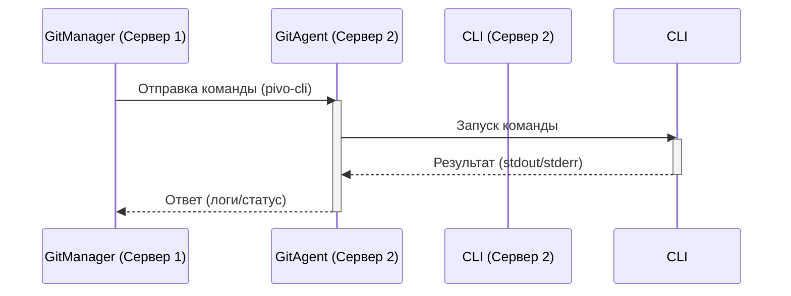

## GitManager
Что это и зачем?

Изначально была цель дать пользователю простой нитерфейс для работы с 1с по методологии Git Flow. Решение представляет из себя 3 коомпонента:
* GitManager 
* GitAgent
* Cli приложение (https://github.com/Untru/pivo-cli)

GitManager и GitAgent Это одна и та жа конфигурация. Идея сделать GitAgent родилась изза того что по сети сборка и разборка исходников работает очень долго, по этому основная база отправляет команды в GitAgent И он уже запускает скрипты.

Общая схема работы:





## Старт работы

Для удобства работы мы сделали скрипт по разворачиванию базы (РазворачиваниеБазы.bat)

Необходимо заполнить переменные, система сама скачает файл с репозитория и развернет базу на сервере.
Основные тесты были с серверной базой, по этому в файловой гарантирвтаь работоспособность нам сложно.
<details>
 <summary><strong> Скрипт </strong></summary>


```bat
@echo off
chcp 65001 > nul
setlocal enabledelayedexpansion

:: =============================================
:: Установка GitManager
:: =============================================

:: Параметры
set "GITHUB_URL=https://github.com/Untru/gitmanager/releases/latest/download/GitManager.cf"
set "TEMP_FILE=%TEMP%\GitManager.cf"
set "DB_SERVER=localhost"  :: Измените на свой сервер СУБД при необходимости
set "DB_NAME=Name"         :: Имя новой базы данных
set "DB_USER=postgres"     :: Пользователь СУБД
set "DB_PWD=postgres"      :: Пароль пользователя СУБД
set "1C_USER=Администратор" :: Пользователь 1С
set "1C_PWD=""             :: Пароль 1С (оставьте пустым, если без пароля)
set "V8VER=8.3.27.1508"    :: Версия 1С


:: Скачиваем файл
echo Скачивание GitManager.cf...
curl -L -o "%TEMP_FILE%" "%GITHUB_URL%"
if %errorlevel% neq 0 (
    echo Ошибка при скачивании файла.
    pause
    exit /b 1
)
echo OK. 1cv8 найден.
pause

:: Создаём и загружаем базу
echo Создание базы данных...
"%ProgramFiles%\1cv8\%V8VER%\bin\1cv8.exe" createinfobase Srvr=%DB_SERVER%;Ref=%DB_NAME%;SQLSrvr=%DB_SERVER%;DBMS=PostgreSQL;SQLDB=%DB_NAME%;SQLUID=%DB_USER%;SQLPwd=%DB_PWD%;CrSQLDB=y;DB=%DB_NAME% /AddInList %DB_NAME% /UseTemplate "%TEMP_FILE%" /Out"CreateDB-%1.log"
@TYPE "CreateDB-%1.log"

if %errorlevel% neq 0 (
    echo Ошибка при создании базы данных.
    pause
    exit /b 1
)

:: Удаляем временный файл
del "%TEMP_FILE%"

echo База данных "%DB_NAME%" успешно создана и добавлена в список баз.
pause
```
Запусить и наслаждаться
</details>

Для удобста старта работ мы разработали "Начальный помошник", Управление разработкой - > Запуск.
Советую пройтись по всем шагам по очередит и заодно изучить что создается, 


Предусмотренно заполнение пользователей/создание проекта добавление баз и установка oscript

<details>
 <summary><strong> Если хотим все заполнять сами </strong></summary>

Для начала работы необходимо создать пользователя с правами "Администратор", далее необходимо заполнить
Настройки пользователя:


Обязательно необходимо заполнить Проект и токен от внешнего репозитория и так же почту пользователя


Проект
Пример заполнения основных полей 


После заполнения базы необходимо создать репозиторий по кнопке


Для работы с гитхаб необходимо установить

[GitHub CLI](https://cli.github.com/)
У службы под которой запужена 1с должны быть права на шару папки

</details>


Необходимо запустить RAC как службу
Сделать это можно с помощью скрипта

<details>
 <summary><strong> Скрипт запуска скрапта добавления службы RAS </strong></summary>

``` bat 
@echo off
rem %1 - полный номер версии 1С:Предприятия
set SrvUserName=.\USR1CV8
set SrvUserPwd="c2o3"
set CtrlPort=1540
set AgentName=localhost
set RASPort=1545
set SrvcName="1C:Enterprise 8.3 Remote Server 26"
set BinPath="\"C:\Program Files\1cv8\8.3.26.1540\bin\ras.exe\" cluster --service --port=%RASPort% %AgentName%:%CtrlPort%"
set Desctiption="1C:Enterprise 8.3 Remote Server 26"
sc stop %SrvcName%
sc delete %SrvcName%
sc create %SrvcName% binPath= %BinPath% start= auto obj= %SrvUserName% password= %SrvUserPwd% displayname= %Desctiption%
```

</details>

Важно, с ситеме получние настроек для задач 
Для вывода логов
set LOGOS_CONFIG=logger.oscript.lib.commands=DEBUG;

ОГРАНИЧЕНИЯ !!! Некоторый функционал не работает в WEB Клиенте

